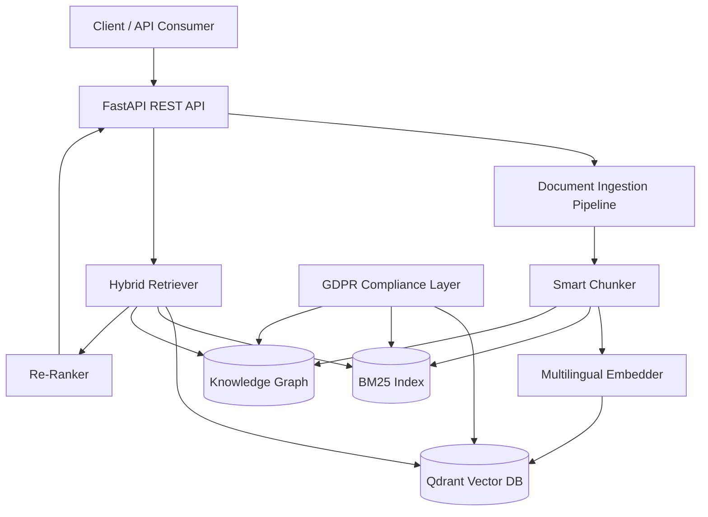

# rag-engine

Lightweight hybrid RAG engine combining vector search, BM25, and knowledge graphs. Built for multilingual document retrieval with GDPR compliance.

## Architecture



## Key Features

- **Hybrid Retrieval** — Vector (Qdrant) + BM25 + Knowledge Graph with weighted re-ranking
- **Multilingual** — Italian, English, Russian out of the box via `intfloat/multilingual-e5-large`
- **Smart Chunking** — Adaptive strategies: fixed, semantic (paragraph-aware), document-aware (headings/articles)
- **GDPR Compliant** — Per-tenant data isolation, right to erasure with cascading deletes, audit logging
- **REST API** — FastAPI with OpenAPI documentation at `/docs`
- **Quality Metrics** — RAGAS-style evaluation: precision, recall, MRR, nDCG, F1

## Quick Start

```bash
git clone https://github.com/ForwardCodeSolutions/rag-engine.git
cd rag-engine
cp .env.example .env
# Edit .env with your API keys
docker compose up -d
```

The API is available at `http://localhost:8000/docs`.

### Local Development

```bash
uv sync       # Install dependencies
make check    # Lint + tests
make dev      # Start with hot reload
```

### Test Suite

209 tests across unit and integration:

```
tests/
  unit/           — 198 tests (models, ingestion, BM25, knowledge graph,
                     hybrid retriever, Qdrant, embedding, GDPR, auth,
                     document endpoints, evaluation, parsers)
  integration/    — 11 tests (full retrieval pipeline, GDPR cascade,
                     API endpoints, quality metrics)
```

## Authentication

All endpoints (except `/health`) require an `X-API-Key` header. Set the `API_KEY` environment variable in `.env`:

```bash
API_KEY=your-secret-key-here
```

## API Endpoints

### Health (no auth required)

```bash
curl http://localhost:8000/api/v1/health
```

```json
{"status": "healthy", "qdrant_connected": true, "version": "0.1.0"}
```

### Upload Document

```bash
curl -X POST http://localhost:8000/api/v1/documents/upload \
  -H "X-API-Key: your-secret-key-here" \
  -F "tenant_id=tenant-1" \
  -F "document_type=general" \
  -F "file=@document.pdf"
```

```json
{
  "id": "a1b2c3d4-...",
  "filename": "document.pdf",
  "tenant_id": "tenant-1",
  "language": "en",
  "chunk_count": 12
}
```

### Search Documents

```bash
curl -X POST http://localhost:8000/api/v1/documents/search \
  -H "X-API-Key: your-secret-key-here" \
  -H "Content-Type: application/json" \
  -d '{"query": "machine learning", "tenant_id": "tenant-1", "top_k": 5}'
```

```json
{
  "query": "machine learning",
  "results": [
    {"document_id": "a1b2c3d4-...", "chunk_index": 3, "text": "...", "score": 0.85}
  ],
  "total_results": 1
}
```

### Delete Document (GDPR)

```bash
curl -X DELETE "http://localhost:8000/api/v1/documents/doc-123?tenant_id=tenant-1&reason=user+request" \
  -H "X-API-Key: your-secret-key-here"
```

```json
{
  "document_id": "doc-123",
  "tenant_id": "tenant-1",
  "bm25_chunks_removed": 3,
  "graph_chunks_removed": 3,
  "message": "Document doc-123 deleted successfully"
}
```

### Delete Tenant Data (GDPR Right to Erasure)

```bash
curl -X DELETE "http://localhost:8000/api/v1/tenants/tenant-1/data?reason=GDPR+erasure+request" \
  -H "X-API-Key: your-secret-key-here"
```

```json
{
  "tenant_id": "tenant-1",
  "documents_removed": 0,
  "message": "All data for tenant tenant-1 deleted successfully"
}
```

## Project Structure

```
src/rag_engine/
  api/              FastAPI routes (upload, search, health, GDPR)
  core/             Hybrid retriever, re-ranker, evaluation metrics
  ingestion/        Document parsers (PDF, DOCX, TXT), chunkers, language detection
  models/           Pydantic models (document, search, config, health, GDPR)
  services/         Embedding service, GDPR compliance service
  storage/          BM25 index, Knowledge Graph (NetworkX), Qdrant vector store
  utils/            Structured logging, audit trail
```

## Design Decisions

See [docs/decisions/](docs/decisions/) for Architecture Decision Records:

| ADR | Decision |
|-----|----------|
| [ADR-001](docs/decisions/ADR-001-hybrid-retrieval.md) | Hybrid retrieval (Vector + BM25 + Graph) |
| [ADR-002](docs/decisions/ADR-002-qdrant-choice.md) | Qdrant as vector database |
| [ADR-003](docs/decisions/ADR-003-chunking-strategy.md) | Adaptive chunking strategy |
| [ADR-004](docs/decisions/ADR-004-multilingual.md) | Multilingual support approach |
| [ADR-005](docs/decisions/ADR-005-gdpr-compliance.md) | GDPR compliance by design |

## How to Extend

- **Add document parsers** — implement `BaseParser` in `src/rag_engine/ingestion/parsers/`
- **Add chunking strategies** — extend `BaseChunker` in `src/rag_engine/ingestion/chunker.py`
- **Add languages** — BM25 indexes are automatically created per language; embedding model handles 100+ languages
- **Add retrieval methods** — pass results to `HybridRetriever.search()` via `vector_results` parameter

## Tech Stack

- Python 3.11+, FastAPI, Pydantic v2
- Qdrant (vector search), rank-bm25 (BM25Plus), NetworkX (knowledge graph)
- sentence-transformers (multilingual embeddings)
- structlog (structured logging), langdetect (language detection)
- uv (package manager), ruff (linter/formatter), pytest

## License

MIT
