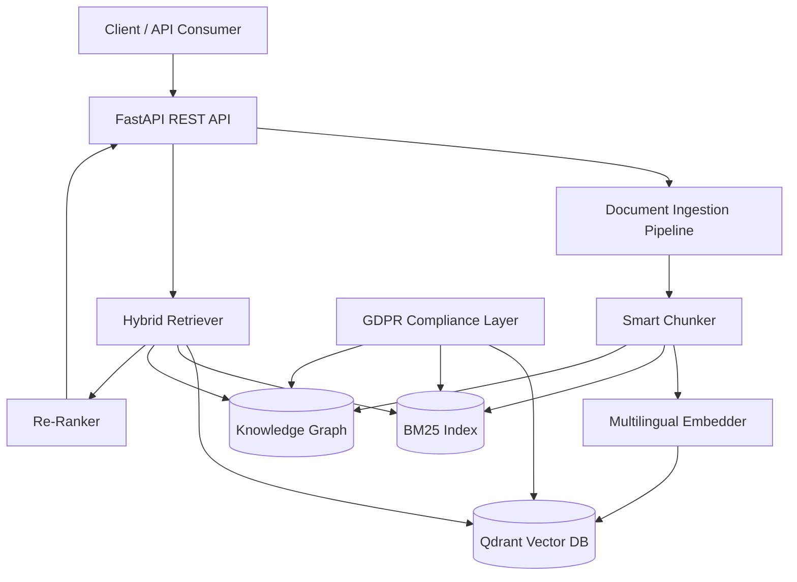
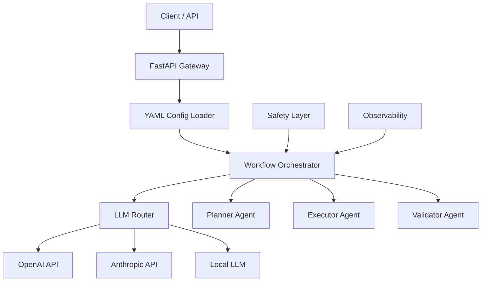
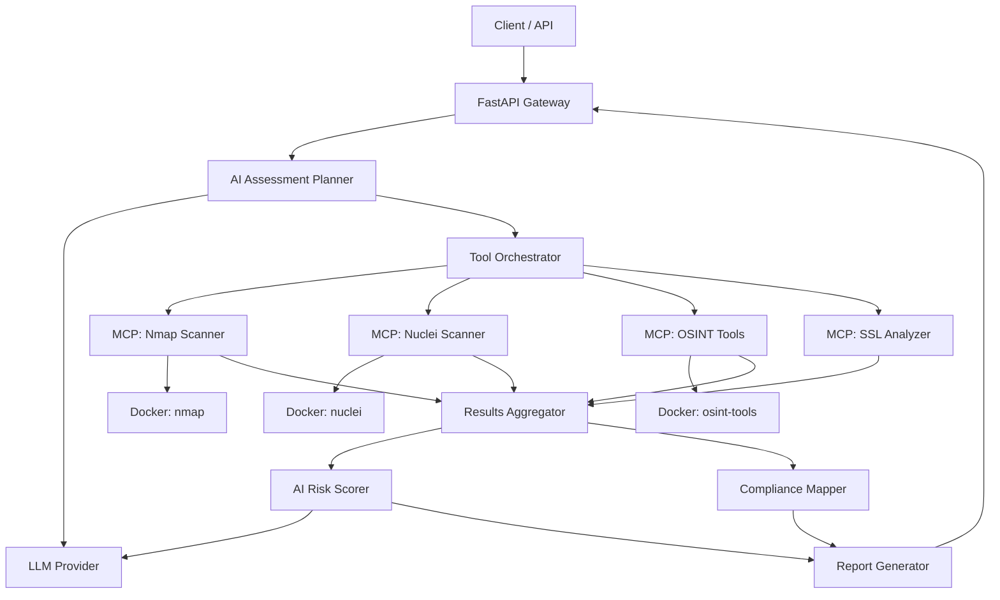
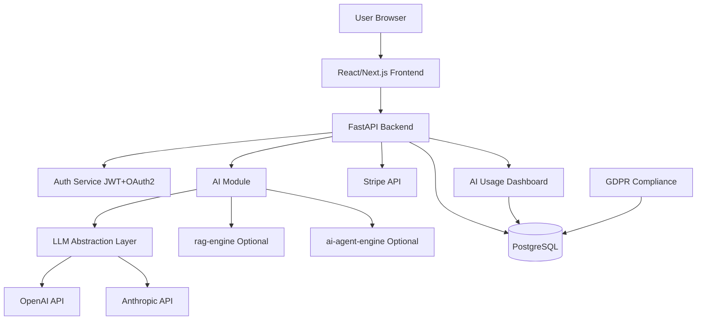

# МАСТЕР-ДОКУМЕНТ: AI-Assisted Development Playbook

## Как пользоваться этим документом

Этот документ — полный playbook для разработки 4 GitHub-проектов с помощью AI-ассистентов (Claude Code, Cursor, Codex).

**Порядок работы:**
1. Скопируй ОБЩИЕ СТАНДАРТЫ (раздел ниже) — они нужны для всех проектов
2. Скопируй секцию конкретного проекта (1, 2, 3 или 4)
3. Вставь всё в новый чат с AI-ассистентом
4. Следуй фазам: Техдокументация → Настройка проекта → Разработка → README

---

# ОБЩИЕ СТАНДАРТЫ (копируй в каждый проект)

## Принципы разработки

### Код с нуля
- Весь код пишется с нуля. НЕ форкать, НЕ копировать из референсных репозиториев
- Референсы — только для изучения архитектурных паттернов и подходов
- Каждый коммит — мой, с первого дня

### Качество кода
- **Читаемые имена переменных**: `user_documents` а не `ud`, `search_results` а не `sr`, `embedding_model` а не `em`
- **Функции делают одну вещь**: если функция > 30 строк — разбей на части
- **Docstrings на английском**: для каждого класса и публичной функции
- **Type hints везде**: Python 3.11+ стиль с `from typing import ...`
- **Нет магических чисел**: все константы в отдельном файле `config.py` или `.env`
- **Обработка ошибок**: конкретные исключения, не голые `except:`
- **Логирование**: structlog для структурированных логов, не print()

### Инструменты (modern Python toolchain 2025-2026)
- **uv** — менеджер пакетов (замена pip/pip-tools, в 10-100x быстрее). Установка: `curl -LsSf https://astral.sh/uv/install.sh | sh`
- **ruff** — линтер + форматтер (замена flake8/black/isort, один инструмент)
- **pytest** — тесты
- **structlog** — структурированное логирование
- **pyproject.toml** — единый конфиг проекта (зависимости, ruff, pytest)
- **Docker Compose** — локальная среда разработки
- **Makefile** — обёртка над командами (make dev, make test, make lint)

### Структура проекта (стандарт для всех)
```
project-name/
├── .claude/                    # Claude Code конфигурация
│   └── skills/                 # Skills (progressive disclosure)
│       ├── build-test-verify/
│       ├── git-commit/
│       ├── new-feature/
│       ├── self-review/
│       └── create-adr/
├── .github/
│   └── workflows/
│       └── ci.yml              # CI: ruff + pytest на каждый push
├── src/
│   └── project_name/           # Основной пакет
│       ├── __init__.py
│       ├── api/                # FastAPI роуты
│       ├── core/               # Бизнес-логика
│       ├── models/             # Pydantic-модели
│       ├── services/           # Сервисы
│       ├── exceptions.py       # Кастомные исключения
│       └── utils/              # Утилиты
├── tests/
│   ├── unit/
│   ├── integration/
│   └── conftest.py             # Общие pytest fixtures
├── docs/
│   ├── architecture.md         # Mermaid-диаграмма
│   ├── api.md                  # API-документация
│   ├── code-conventions.md     # Стиль кода (progressive disclosure)
│   ├── testing-strategy.md     # Как тестировать
│   └── decisions/              # ADR (Architecture Decision Records)
├── Makefile                    # dev, test, lint, check, fix
├── docker-compose.yml
├── Dockerfile
├── pyproject.toml              # uv + ruff конфигурация
├── CLAUDE.md                   # < 100 строк, WHY/WHAT/HOW
├── README.md
├── .env.example
└── LICENSE                     # MIT
```

### CI/CD (.github/workflows/ci.yml)

```yaml
name: CI
on: [push, pull_request]
jobs:
  check:
    runs-on: ubuntu-latest
    steps:
      - uses: actions/checkout@v4
      - uses: astral-sh/setup-uv@v5
      - run: uv sync
      - run: uv run ruff check src/
      - run: uv run ruff format --check src/
      - run: uv run pytest tests/ -v
```

### CLAUDE.md (создать в корне каждого проекта)

Этот файл Claude Code читает автоматически при старте сессии.
**Правила**: максимум 100 строк, структура WHY/WHAT/HOW, progressive disclosure (ссылки на docs/, а не всё внутри).

```markdown
# Название проекта

## Why
[1-2 предложения: зачем этот проект существует]

## What
- `src/project_name/` — основной пакет
- `tests/` — pytest (unit + integration)
- `docs/` — архитектура, API, ADR
- `docs/decisions/` — Architecture Decision Records

## How

### Commands
- Run: `make dev` (docker compose up -d)
- Test: `make test` (pytest tests/ -v)
- Lint: `make lint` (ruff check + ruff format)
- All checks: `make check` (lint + test)

### Verify changes
After ANY change, run `make check`. Do not commit if it fails.

### Further reading
**IMPORTANT:** Before starting any task, identify which docs below are relevant and read them first.
- `docs/architecture.md` — System design and Mermaid diagrams
- `docs/api.md` — API endpoints and request/response formats
- `docs/decisions/` — ADRs explaining why we chose X over Y
- `docs/code-conventions.md` — Naming, style, patterns
- `docs/testing-strategy.md` — What to test and how
```

### docs/code-conventions.md (выносим стиль кода из CLAUDE.md)

Progressive disclosure: Claude прочитает этот файл только когда нужно.

```markdown
# Code Conventions

## Naming
- Readable English names: `user_documents` not `ud`
- Boolean: `is_active`, `has_permission`, `can_edit`
- Constants: UPPER_SNAKE_CASE in config.py

## Functions
- Single responsibility: one function = one thing
- Max 30 lines per function
- All public functions have docstrings
- Type hints everywhere (Python 3.11+ style)

## Error Handling
- Specific exceptions, never bare `except:`
- Custom exceptions in src/project_name/exceptions.py

## Logging
- structlog for structured logs, never print()
- Log levels: debug/info/warning/error

## Data Validation
- Pydantic v2 for all request/response models
- Settings via pydantic-settings + .env

## Dependencies
- uv for package management (not pip)
- pyproject.toml (not setup.py)
- ruff for linting + formatting
```

### docs/testing-strategy.md

```markdown
# Testing Strategy

## Structure
- tests/unit/ — isolated logic, mocked dependencies
- tests/integration/ — API endpoints, database, external services

## Rules
- Every new feature needs tests
- Use pytest fixtures, not setUp/tearDown
- Mock external services (LLM, databases) in unit tests
- Integration tests use Docker services

## Running
- All tests: `pytest tests/ -v`
- Unit only: `pytest tests/unit/ -v`
- With coverage: `pytest --cov=src tests/`
```

### Makefile (в корне каждого проекта)

```makefile
.PHONY: dev test lint check

dev:
	docker compose up -d

test:
	pytest tests/ -v

lint:
	ruff check src/ && ruff format --check src/

fix:
	ruff check src/ --fix && ruff format src/

check: lint test
```

### Docker: изоляция проектов (ВАЖНО)

Все 4 проекта используют Docker Compose. Чтобы они НЕ конфликтовали друг с другом и с другими проектами на твоей машине — каждый проект получает свой диапазон портов и префикс контейнеров.

**Таблица портов (зафиксировано, не менять):**

| Проект | API порт | Доп. сервисы | Префикс контейнеров |
|--------|----------|-------------|---------------------|
| rag-engine | 8000 | Qdrant: 6333 | rag_ |
| ai-agent-engine | 8001 | — | agent_ |
| ai-security-orchestrator | 8002 | nmap, nuclei: внутренние | security_ |
| ai-saas-starter | 8003 | PostgreSQL: 5433, Frontend: 3000 | saas_ |

**Правила:**
- `docker compose up -d` поднимает ТОЛЬКО контейнеры текущего проекта (Docker Compose привязан к папке)
- Контейнеры разных проектов НЕ мешают друг другу если порты не пересекаются
- Если у тебя уже есть другой проект на порту 8000 — останови его (`docker compose down` в его папке) или сдвинь порт в .env
- PostgreSQL по умолчанию на 5432 — для ai-saas-starter используем 5433 чтобы не конфликтовать с локальным PostgreSQL
- **Рекомендация**: работай над одним проектом за раз. Закончил сессию → `docker compose down`

**Шаблон docker-compose.yml с правильным prefix:**

```yaml
# docker-compose.yml
# ВАЖНО: container_name с префиксом проекта предотвращает конфликты имён
services:
  api:
    container_name: PREFIX_api        # заменить PREFIX на rag/agent/security/saas
    build: .
    ports: ["ПОРТ:8000"]             # внешний порт из таблицы выше
    env_file: .env
    restart: unless-stopped
```

**Полезные команды:**
```bash
# Посмотреть ВСЕ запущенные контейнеры (всех проектов)
docker ps

# Остановить контейнеры ТЕКУЩЕГО проекта (из его папки)
docker compose down

# Остановить ВСЕ контейнеры на машине
docker stop $(docker ps -q)

# Проверить какие порты заняты
docker ps --format "table {{.Names}}\t{{.Ports}}"
```

### Skills для Claude Code (создать в .claude/skills/)

Skills используют progressive disclosure: SKILL.md — точка входа (< 500 строк), supporting files загружаются по требованию.

#### .claude/skills/build-test-verify/SKILL.md
```markdown
---
name: build-test-verify
description: Run build, tests, and verification after code changes. Use after implementing any feature, fixing bugs, or refactoring code.
---
After making code changes:

1. Run linter: `make lint`
   - If errors found, fix them before proceeding
2. Run tests: `make test`
   - If tests fail, fix the code, not the tests
3. If both pass, the change is ready for commit

If any step fails:
- Read the error message carefully
- Fix the root cause (not symptoms)
- Run the full check again: `make check`

Never skip verification. Never commit failing code.
```

#### .claude/skills/git-commit/SKILL.md
```markdown
---
name: git-commit
description: Create a well-formatted git commit. Use after build-test-verify passes successfully.
---
## Commit format
Use conventional commits: `type: short description`

Types: feat, fix, docs, refactor, test, chore

## Rules
- One logical change per commit
- Message in English, lowercase, no period at end
- Max 72 characters for subject line
- If change is complex, add body after blank line

## Examples
- `feat: add hybrid search combining vector and BM25 retrieval`
- `fix: handle empty document in chunking pipeline`
- `refactor: extract embedding logic into separate service`
- `test: add integration tests for search API`
- `docs: add ADR for Qdrant selection`

## Process
1. Run `make check` first (never commit failing code)
2. Stage relevant files: `git add <specific files>`
3. Commit with meaningful message
4. Never use `git add .` blindly
```

#### .claude/skills/new-feature/SKILL.md
```markdown
---
name: new-feature
description: Implement a new feature following the project workflow. Use when adding new functionality, endpoints, or components.
---
## Workflow: Research → Plan → Implement → Test → Review

### 1. Plan
- Create ADR in `docs/decisions/` if this involves an architectural choice
- Read `docs/code-conventions.md` for naming and style rules
- Read `docs/architecture.md` to understand where this fits

### 2. Implement (in this order)
- Define Pydantic models in `src/project_name/models/`
- Write service logic in `src/project_name/services/`
- Create API route in `src/project_name/api/`
- Add error handling with specific exceptions

### 3. Test
- Write unit tests in `tests/unit/`
- Write integration tests if API endpoint involved
- Run `make check` — must pass

### 4. Document
- Update `docs/api.md` if new endpoint added
- Update README.md if user-facing change

### 5. Commit
- Use the git-commit skill for proper commit format
```

#### .claude/skills/self-review/SKILL.md
```markdown
---
name: self-review
description: Review code before committing. Use as final check before any git commit.
---
Review checklist — verify ALL items:

## Naming & Style
- [ ] Variable names are readable English (not abbreviations)
- [ ] Functions are under 30 lines
- [ ] Type hints on all function signatures
- [ ] Docstrings on classes and public functions

## Logic
- [ ] No hardcoded values — use config.py or .env
- [ ] Specific exception handling (no bare except:)
- [ ] Edge cases handled (empty input, None, invalid data)

## Security & GDPR
- [ ] No secrets in code (use .env)
- [ ] User data is tenant-isolated
- [ ] Delete endpoints cascade properly

## Tests
- [ ] New code has corresponding tests
- [ ] `make check` passes

If any item fails — fix it before committing.
```

#### .claude/skills/create-adr/SKILL.md
```markdown
---
name: create-adr
description: Create an Architecture Decision Record. Use when making a significant technical choice like selecting a database, framework, or approach.
---
Create ADR in `docs/decisions/` with this format:

## Template: docs/decisions/ADR-NNN-title.md

```
# ADR-NNN: [Decision Title]

## Status
Accepted

## Context
[Why did this question come up? What problem are we solving?]

## Decision
[What we chose and why]

## Alternatives Considered
- **Alternative A**: [description] — rejected because [reason]
- **Alternative B**: [description] — rejected because [reason]

## Consequences
- Positive: [benefits]
- Negative: [tradeoffs we accept]
```

## Rules
- Number sequentially: ADR-001, ADR-002, etc.
- One decision per ADR
- Write BEFORE implementing (not after)
- Keep under 1 page
```

### Workflow разработки (Research → Plan → Implement)

Это AI-Assisted Engineering, НЕ слепой vibe coding. Каждый кусок кода должен быть понятен разработчику.

**Золотое правило**: не коммить код, который не можешь объяснить другому человеку.

Для каждой фичи:

1. **Research**: Изучи как это реализовано в референсных репо (смотри конкретные файлы, не весь проект)
2. **Plan**: Опиши подход в ADR (используй skill create-adr). Определи модели данных ДО написания кода
3. **Implement**: Пиши код малыми итерациями. Одна итерация = одна логическая единица. Начинай с mock-данных, потом подключай реальные сервисы
4. **Test**: Тест после КАЖДОГО изменения (`make check`). Не накапливай непроверенный код
5. **Review**: Используй skill self-review перед коммитом. Прочитай diff — понимаешь ли ты каждую строку?
6. **Commit**: Используй skill git-commit. Атомарный коммит с осмысленным сообщением

**При работе с AI-ассистентом:**
- Давай конкретные задачи, не абстрактные ("добавь BM25 поиск в search service" а не "сделай поиск лучше")
- Если AI сгенерировал код > 50 строк — прочитай и пойми каждую часть
- Если не понимаешь что код делает — попроси объяснить, не принимай вслепую
- После каждой итерации: `make check`. Не двигайся дальше пока не зелёное

### Git-конвенции
- Conventional commits: `feat:`, `fix:`, `docs:`, `refactor:`, `test:`
- Маленькие, атомарные коммиты (одна логическая единица = один коммит)
- Осмысленные сообщения на английском
- Пример: `feat: add hybrid search combining vector and BM25 retrieval`

---

# ═══════════════════════════════════════════════════════
# ПРОЕКТ 1: rag-engine
# ═══════════════════════════════════════════════════════

## Контекст для AI-ассистента

Ты помогаешь мне разработать **rag-engine** — легковесный RAG-движок (Retrieval-Augmented Generation) для поиска по документам с AI.

### Референсные репозитории (ТОЛЬКО для изучения архитектуры, НЕ копировать код)

| # | Репозиторий | URL | Что изучить |
|---|------------|-----|-------------|
| 1 | infiniflow/ragflow | https://github.com/infiniflow/ragflow | Глубокий парсинг документов, enterprise RAG, Docker-деплой |
| 2 | HKUDS/LightRAG | https://github.com/HKUDS/LightRAG | Графовый поиск, knowledge graphs, подход EMNLP2025 |
| 3 | HKUDS/RAG-Anything | https://github.com/HKUDS/RAG-Anything | Мультимодальный RAG: текст + изображения + таблицы |
| 4 | deepset-ai/haystack | https://github.com/deepset-ai/haystack | Архитектура пайплайнов, модульные ноды, BM25 + dense |
| 5 | stanford-oval/storm | https://github.com/stanford-oval/storm | Генерация отчётов с цитированием |

### Стек
- Python 3.11+, FastAPI, Qdrant, sentence-transformers
- BM25 (rank-bm25), NetworkX (для knowledge graph)
- Docker Compose, pytest, ruff, structlog

### Целевые фичи
1. Гибридный поиск: Qdrant (векторный) + BM25 (ключевые слова) + Knowledge Graph
2. Многоязычность: итальянский / английский / русский из коробки
3. Умный чанкинг: адаптивные стратегии (юридические, технические, общие документы)
4. REST API: FastAPI с OpenAPI-документацией
5. GDPR: изоляция данных по tenant, право на удаление, аудит-логи
6. Оценка качества: метрики RAGAS (faithfulness, relevancy, context precision)
7. Docker Compose: запуск одной командой

---

## ФАЗА 1: Техническая документация (НАЧНИ С ЭТОГО)

Прежде чем писать код, создай полную техническую документацию. Это основа проекта.

### Шаг 1.1: Architecture Decision Records (ADRs)

Создай файлы в `docs/decisions/`:

**ADR-001-hybrid-retrieval.md** — Почему гибридный поиск (Vector + BM25 + Graph)?
- Контекст: разные типы запросов требуют разных подходов
- Решение: комбинация трёх методов с взвешенным ре-ранкингом
- Альтернативы: только vector search (теряем keyword precision), только BM25 (теряем семантику)

**ADR-002-qdrant-choice.md** — Почему Qdrant, а не Pinecone/Weaviate/Milvus?
- Open-source, self-hosted (GDPR), Rust-based (производительность), REST + gRPC API

**ADR-003-chunking-strategy.md** — Адаптивный чанкинг vs фиксированный
- Разные документы требуют разных стратегий
- Юридические: по статьям/пунктам. Технические: по секциям. Общие: по смыслу (semantic)

**ADR-004-multilingual.md** — Подход к многоязычности
- Модель: multilingual-e5-large или paraphrase-multilingual
- Language detection: langdetect при загрузке
- Отдельные BM25-индексы по языкам

**ADR-005-gdpr-compliance.md** — GDPR by design
- Tenant isolation: каждый пользователь = отдельная коллекция в Qdrant
- Right to erasure: API для полного удаления данных пользователя
- Audit log: все операции логируются

### Шаг 1.2: Диаграмма архитектуры

Создай `docs/architecture.md` с Mermaid-диаграммой:



### Шаг 1.3: API-спецификация

Создай `docs/api.md` с описанием эндпоинтов:

```
POST /api/v1/documents/upload     — Загрузка документа
POST /api/v1/documents/search     — Поиск по документам
GET  /api/v1/documents/{id}       — Информация о документе
DELETE /api/v1/documents/{id}     — Удаление документа (GDPR)
DELETE /api/v1/tenants/{id}/data  — Удаление всех данных tenant (GDPR)
GET  /api/v1/health               — Health check
GET  /api/v1/metrics              — Метрики качества
```

### Шаг 1.4: Pydantic-модели

Определи все модели данных в `docs/models.md` до написания кода:
- DocumentUpload, DocumentResponse, SearchQuery, SearchResult
- TenantConfig, GDPRDeleteRequest, HealthResponse

---

## ФАЗА 2: Настройка проекта

### Шаг 2.1: Инициализация репозитория
```bash
mkdir rag-engine && cd rag-engine
git init
# Создай структуру папок как в ОБЩИХ СТАНДАРТАХ
# Создай CLAUDE.md, .env.example, pyproject.toml
git add . && git commit -m "feat: initial project structure"
```

### Шаг 2.2: CLAUDE.md (специфичный для этого проекта)

```markdown
# rag-engine

## Why
Lightweight RAG engine for multilingual document search with hybrid retrieval (Vector + BM25 + Knowledge Graph). Built for EU clients with GDPR compliance.

## What
- `src/rag_engine/api/` — FastAPI routes (upload, search, delete)
- `src/rag_engine/core/` — Hybrid retrieval, reranker
- `src/rag_engine/ingestion/` — Document parsing, chunking, embedding
- `src/rag_engine/models/` — Pydantic models
- `src/rag_engine/storage/` — Qdrant, BM25, Knowledge Graph adapters
- `tests/` — pytest (unit + integration)

## How
- Run: `make dev` → http://localhost:8000/docs
- Test: `make check` (ruff + pytest)
- Dependencies: `uv sync`

## Further reading
**IMPORTANT:** Read relevant docs before making changes.
- `docs/architecture.md` — System diagram and component overview
- `docs/api.md` — All endpoints with request/response examples
- `docs/decisions/` — ADRs (Qdrant choice, chunking strategy, etc.)
- `docs/code-conventions.md` — Naming, style, patterns
- `docs/testing-strategy.md` — What to test and how

## Critical rules
- Hybrid search: vector + BM25 + knowledge graph with weighted re-ranking
- Multilingual: Italian, English, Russian (multilingual embeddings)
- GDPR: tenant isolation, right to erasure, audit logging
- All secrets via .env (QDRANT_URL, EMBEDDING_MODEL, API_KEY)
```

### Шаг 2.3: Docker Compose
```yaml
# docker-compose.yml
services:
  api:
    container_name: rag_api
    build: .
    ports: ["8000:8000"]
    env_file: .env
    depends_on: [qdrant]
    restart: unless-stopped
  qdrant:
    container_name: rag_qdrant
    image: qdrant/qdrant:latest
    ports: ["6333:6333"]
    volumes: [qdrant_data:/qdrant/storage]
    restart: unless-stopped
volumes:
  qdrant_data:
```

---

## ФАЗА 3: Разработка (пошагово)

Порядок разработки — от ядра к периферии:

### Итерация 1: Базовые модели и конфиг
- Pydantic-модели (documents, search, config)
- Настройка structlog
- Настройка FastAPI с health endpoint
- **Коммит**: `feat: add base models and FastAPI setup`

### Итерация 2: Document Ingestion
- Парсинг документов (PDF, DOCX, TXT, MD)
- Smart chunking (3 стратегии: fixed, semantic, document-aware)
- Language detection
- **Коммит**: `feat: add document ingestion with smart chunking`

### Итерация 3: Embedding + Qdrant Storage
- Multilingual embeddings (sentence-transformers)
- Qdrant collection management (per-tenant)
- **Коммит**: `feat: add multilingual embeddings and Qdrant storage`

### Итерация 4: BM25 Index
- BM25 индексация при загрузке документов
- BM25 поиск
- **Коммит**: `feat: add BM25 keyword search`

### Итерация 5: Knowledge Graph
- Извлечение сущностей и связей из чанков
- NetworkX граф
- Graph-based retrieval
- **Коммит**: `feat: add knowledge graph extraction and retrieval`

### Итерация 6: Hybrid Search + Re-ranking
- Объединение результатов vector + BM25 + graph
- Weighted re-ranking с нормализацией скоров
- **Коммит**: `feat: add hybrid retrieval with weighted re-ranking`

### Итерация 7: GDPR Layer
- Tenant isolation
- DELETE endpoints (document, all tenant data)
- Audit logging
- **Коммит**: `feat: add GDPR compliance layer`

### Итерация 8: Тесты + Quality
- Unit тесты для каждого компонента
- Integration тесты для API
- RAGAS метрики
- **Коммит**: `test: add comprehensive test suite`

### Итерация 9: README + Документация
- Полный README.md (по шаблону из ОБЩИХ СТАНДАРТОВ)
- Финальная API-документация
- **Коммит**: `docs: add complete README and documentation`

---

## ФАЗА 4: README (шаблон)

```markdown
# 🔍 rag-engine

Lightweight hybrid RAG engine combining vector search, BM25, and knowledge graphs. Built for multilingual document retrieval with GDPR compliance.

## Architecture

[Mermaid-диаграмма из docs/architecture.md]

## Key Features

- **Hybrid Retrieval**: Vector (Qdrant) + BM25 + Knowledge Graph with weighted re-ranking
- **Multilingual**: Italian, English, Russian out of the box
- **Smart Chunking**: Adaptive strategies for legal, technical, and general documents
- **GDPR Compliant**: Tenant isolation, right to erasure, audit logging
- **REST API**: Full OpenAPI documentation at /docs
- **Quality Metrics**: RAGAS evaluation dashboard

## Quick Start

\`\`\`bash
git clone https://github.com/[username]/rag-engine.git
cd rag-engine
cp .env.example .env
docker compose up -d
# API available at http://localhost:8000/docs
\`\`\`

## Design Decisions

See [docs/decisions/](docs/decisions/) for Architecture Decision Records:
- Why hybrid retrieval over single-method search
- Why Qdrant over Pinecone/Weaviate
- Adaptive chunking strategy
- Multilingual approach
- GDPR by design

## API

[Краткое описание endpoints с примерами curl]

## How to Extend

- Add new document parsers in `src/rag_engine/ingestion/parsers/`
- Add new retrieval methods in `src/rag_engine/core/retrievers/`
- Add new languages by configuring embedding models in `.env`

## License

MIT
```

---

# ═══════════════════════════════════════════════════════
# ПРОЕКТ 2: ai-agent-engine
# ═══════════════════════════════════════════════════════

## Контекст для AI-ассистента

Ты помогаешь мне разработать **ai-agent-engine** — легковесный движок для оркестрации AI-агентов с YAML-конфигурациями.

### Референсные репозитории (ТОЛЬКО для изучения архитектуры)

| # | Репозиторий | URL | Что изучить |
|---|------------|-----|-------------|
| 1 | langflow-ai/langflow | https://github.com/langflow-ai/langflow | Визуальный билдер workflow, интеграция с LangChain |
| 2 | langgenius/dify | https://github.com/langgenius/dify | Agentic workflows, поддержка множества моделей |
| 3 | simstudio-ai/sim | https://github.com/simstudio-ai/sim | Чистая архитектура agent workflows, современный дизайн |
| 4 | Significant-Gravitas/AutoGPT | https://github.com/Significant-Gravitas/AutoGPT | Автономные агенты, визуальные workflows |
| 5 | EvoAgentX/EvoAgentX | https://github.com/EvoAgentX/EvoAgentX | Саморазвивающиеся агенты, оптимизация workflow |

### Стек
- Python 3.11+, FastAPI, asyncio, Pydantic v2
- YAML (PyYAML), httpx (async HTTP), structlog
- Docker Compose, pytest, ruff

### Целевые фичи
1. YAML/JSON Workflow Config: декларативные описания workflows
2. Multi-LLM Router: автовыбор модели (OpenAI / Anthropic / локальные)
3. Встроенные паттерны: Router → Planner → Executor → Validator
4. Наблюдаемость: структурированные логи, метрики, трейсинг
5. Безопасность: rate limiting, фильтрация контента, контроль затрат
6. 3 примера агентов: анализ документов, исследовательский ассистент, поддержка клиентов
7. Plugin-система для расширения

---

## ФАЗА 1: Техническая документация

### Шаг 1.1: ADRs

**ADR-001-yaml-workflows.md** — Почему YAML, а не Python DSL или визуальный редактор?
- YAML: version control friendly, читаемый, не требует coding для модификации
- Альтернативы: Python DSL (мощнее но сложнее), JSON (менее читаемый)

**ADR-002-multi-llm-router.md** — Стратегия маршрутизации между моделями
- По типу задачи: simple → GPT-4o-mini, complex → Claude Opus, code → специализированная
- Fallback-цепочки при ошибках
- Cost-aware routing: выбирать дешёвую модель если качество достаточное

**ADR-003-agent-patterns.md** — Встроенные паттерны агентов
- Router: направляет запрос нужному агенту
- Planner: разбивает задачу на шаги
- Executor: выполняет шаги с вызовом инструментов
- Validator: проверяет результат на качество

**ADR-004-observability.md** — Подход к наблюдаемости
- structlog для каждого шага агента
- Метрики: latency, token usage, cost per request
- Trace ID для сквозного отслеживания

**ADR-005-safety-layer.md** — Безопасность и контроль затрат
- Rate limiting per workflow
- Max tokens per request
- Content filtering (optional)
- Budget alerts

### Шаг 1.2: Диаграмма архитектуры



### Шаг 1.3: Формат YAML Workflow

```yaml
# docs/workflow-spec.md — описать формат
name: document-analyzer
description: Анализирует документ и создаёт саммари
version: "1.0"

settings:
  max_tokens: 4000
  timeout_seconds: 30
  cost_limit_usd: 0.50

steps:
  - id: classify
    agent: router
    model: gpt-4o-mini
    prompt: "Определи тип документа: legal, technical, general"
    
  - id: analyze
    agent: planner
    model: claude-sonnet
    prompt: "Разбей анализ на шаги для документа типа {classify.output}"
    depends_on: [classify]
    
  - id: execute
    agent: executor
    model: auto  # router выберет по задаче
    prompt: "Выполни шаги: {analyze.output}"
    depends_on: [analyze]
    
  - id: validate
    agent: validator
    model: gpt-4o-mini
    prompt: "Проверь качество анализа"
    depends_on: [execute]
```

### Шаг 1.4: API-спецификация

```
POST /api/v1/workflows/execute     — Запуск workflow
GET  /api/v1/workflows             — Список доступных workflows
GET  /api/v1/workflows/{id}/status — Статус выполнения
POST /api/v1/workflows/validate    — Валидация YAML-конфига
GET  /api/v1/models                — Доступные LLM-модели
GET  /api/v1/metrics               — Метрики (latency, cost, tokens)
GET  /api/v1/health                — Health check
```

---

## ФАЗА 2: Настройка проекта

### CLAUDE.md для ai-agent-engine

```markdown
# ai-agent-engine

## Why
Lightweight AI agent orchestration engine with YAML workflows and multi-LLM routing. Not a monolith like Dify — a focused, extensible tool.

## What
- `src/agent_engine/api/` — FastAPI routes
- `src/agent_engine/core/` — Orchestrator, Router, Agent patterns
- `src/agent_engine/config/` — YAML loader, validation
- `src/agent_engine/llm/` — LLM providers (OpenAI, Anthropic, Local)
- `src/agent_engine/safety/` — Rate limiting, cost controls
- `src/agent_engine/observe/` — Logging, metrics, tracing
- `workflows/` — Example YAML configs
- `tests/` — pytest

## How
- Run: `make dev` → http://localhost:8001/docs
- Test: `make check`
- Dependencies: `uv sync`

## Further reading
**IMPORTANT:** Read relevant docs before making changes.
- `docs/architecture.md` — System diagram
- `docs/api.md` — All endpoints
- `docs/decisions/` — ADRs (YAML choice, routing strategy, etc.)
- `docs/workflow-spec.md` — YAML workflow format specification
- `docs/code-conventions.md` — Naming, style, patterns

## Critical rules
- Async everywhere: all LLM calls via httpx async
- YAML workflows: declarative, version control friendly
- Multi-LLM: OpenAI, Anthropic, local models via single interface
- Safety: rate limiting, cost controls, content filtering
```

---

## ФАЗА 3: Разработка (пошагово)

### Итерация 1: Core Models + Config
- Pydantic-модели (Workflow, Step, AgentConfig, LLMResponse)
- YAML config loader с валидацией
- **Коммит**: `feat: add core models and YAML config loader`

### Итерация 2: LLM Router
- Абстрактный LLMProvider interface
- OpenAI provider (async httpx)
- Anthropic provider (async httpx)
- Router logic (по типу задачи, fallback, cost-aware)
- **Коммит**: `feat: add multi-LLM router with OpenAI and Anthropic providers`

### Итерация 3: Agent Patterns
- BaseAgent abstract class
- RouterAgent, PlannerAgent, ExecutorAgent, ValidatorAgent
- **Коммит**: `feat: add built-in agent patterns`

### Итерация 4: Workflow Orchestrator
- Парсинг зависимостей между шагами (DAG)
- Последовательное и параллельное выполнение
- Передача данных между шагами
- **Коммит**: `feat: add workflow orchestrator with dependency resolution`

### Итерация 5: Observability
- Structlog для каждого шага
- Trace ID propagation
- Метрики (latency, tokens, cost)
- **Коммит**: `feat: add observability layer`

### Итерация 6: Safety Layer
- Rate limiter (per workflow, per user)
- Cost controller (budget limits)
- Content filter (optional)
- **Коммит**: `feat: add safety layer with rate limiting and cost controls`

### Итерация 7: Примеры агентов
- Document Analyzer workflow (YAML + код)
- Research Assistant workflow
- Customer Support Bot workflow
- **Коммит**: `feat: add 3 example agent workflows`

### Итерация 8: API + Тесты
- FastAPI endpoints
- Unit и integration тесты
- Mock LLM providers для тестов
- **Коммит**: `test: add comprehensive test suite`

### Итерация 9: README + Документация
- По шаблону
- **Коммит**: `docs: add complete README and documentation`
# ═══════════════════════════════════════════════════════
# ПРОЕКТ 3: ai-security-orchestrator
# ═══════════════════════════════════════════════════════

## Контекст для AI-ассистента

Ты помогаешь мне разработать **ai-security-orchestrator** — AI-оркестратор безопасности с MCP-протоколом. Ключевое отличие от существующих решений: они просто обёртки над CLI-инструментами, а мы строим интеллектуальную оркестрацию с AI-планировщиком.

### Референсные репозитории (ТОЛЬКО для изучения архитектуры)

| # | Репозиторий | URL | Что изучить |
|---|------------|-----|-------------|
| 1 | FuzzingLabs/mcp-security-hub | https://github.com/FuzzingLabs/mcp-security-hub | 36 MCP-серверов, 175+ инструментов, категоризация |
| 2 | zebbern/zebbern-kali-mcp | https://github.com/zebbern/zebbern-kali-mcp | 139 функций, наиболее полный Kali MCP-сервер |
| 3 | 0x4m4/hexstrike-ai | https://github.com/0x4m4/hexstrike-ai | 150+ инструментов, мульти-агентная архитектура |
| 4 | frishtik/osint-tools-mcp-server | https://github.com/frishtik/osint-tools-mcp-server | OSINT: Sherlock, Maigret, SpiderFoot, GHunt |
| 5 | Puliczek/awesome-mcp-security | https://github.com/Puliczek/awesome-mcp-security | Каталог всех security MCP-серверов |

### Стек
- Python 3.11+, FastAPI, MCP SDK, asyncio
- Docker (изоляция инструментов), structlog
- Jinja2 (шаблоны отчётов), NetworkX (граф атак)

### Целевые фичи
1. AI-планировщик: анализирует цель, выбирает инструменты, строит план
2. MCP-слой: модульные серверы для nmap, nuclei, OSINT, SSL
3. Единый отчёт: AI генерирует отчёт из результатов всех инструментов
4. Compliance-маппинг: OWASP Top 10, CIS Benchmarks
5. Оценка рисков: AI-driven severity scoring
6. Docker-изоляция: каждый инструмент в своём контейнере

---

## ФАЗА 1: Техническая документация

### Шаг 1.1: ADRs

**ADR-001-intelligent-orchestration.md** — Почему AI-планировщик, а не статические скрипты?
- Контекст: существующие решения — просто CLI-обёртки, пользователь вручную выбирает инструменты
- Решение: AI-агент анализирует цель (домен, IP, scope) и автоматически составляет план
- Преимущество: адаптивность, автоматическая эскалация при находках

**ADR-002-mcp-protocol.md** — Почему MCP, а не прямые API-вызовы?
- MCP — стандарт Anthropic для tool integration
- Модульность: каждый инструмент = отдельный MCP-сервер
- Масштабируемость: легко добавить новый инструмент

**ADR-003-docker-isolation.md** — Почему Docker для инструментов?
- Безопасность: изоляция сетевых инструментов от основной системы
- Воспроизводимость: одинаковое окружение везде
- Управление зависимостями: nmap, nuclei имеют свои зависимости

**ADR-004-report-generation.md** — AI-генерация отчётов
- Jinja2 шаблоны + LLM для анализа и описания
- Формат: HTML + PDF export
- Compliance mapping: автоматическая привязка находок к стандартам

**ADR-005-risk-scoring.md** — AI-driven оценка рисков
- CVSS-подобная система + AI-контекст
- Учёт: критичность сервиса, exposure, exploitability

### Шаг 1.2: Диаграмма архитектуры



### Шаг 1.3: API-спецификация

```
POST /api/v1/assessments              — Запуск оценки безопасности
GET  /api/v1/assessments/{id}         — Статус оценки
GET  /api/v1/assessments/{id}/report  — Получить отчёт (HTML/PDF)
GET  /api/v1/tools                    — Список доступных инструментов
POST /api/v1/tools/{name}/run         — Запустить конкретный инструмент
GET  /api/v1/health                   — Health check
```

---

## ФАЗА 2: Настройка проекта

### CLAUDE.md для ai-security-orchestrator

```markdown
# ai-security-orchestrator

## Why
AI-powered security assessment orchestrator using MCP protocol. Unlike existing CLI wrappers, this uses an AI planner that automatically selects tools and builds attack plans.

## What
- `src/security_orchestrator/api/` — FastAPI routes
- `src/security_orchestrator/planner/` — AI Assessment Planner
- `src/security_orchestrator/mcp/` — MCP servers (nmap, nuclei, osint, ssl)
- `src/security_orchestrator/reporting/` — Report generator + Jinja2 templates
- `src/security_orchestrator/compliance/` — OWASP, CIS mapping
- `src/security_orchestrator/risk/` — Risk scoring
- `docker/` — Dockerfiles for security tools
- `tests/` — pytest

## How
- Run: `make dev` → http://localhost:8002/docs
- Test: `make check`
- Dependencies: `uv sync`

## Further reading
**IMPORTANT:** Read relevant docs before making changes.
- `docs/architecture.md` — System diagram with MCP flow
- `docs/api.md` — All endpoints
- `docs/decisions/` — ADRs (MCP choice, Docker isolation, etc.)
- `docs/code-conventions.md` — Naming, style, patterns

## Critical rules
- MCP protocol for all tool integrations
- AI planner: automatic tool selection based on target
- Docker isolation: each security tool in its own container
- Compliance: OWASP Top 10, CIS Benchmarks mapping
- AUTHORIZED TESTING ONLY — add disclaimer to README and API
```

---

## ФАЗА 3: Разработка (пошагово)

### Итерация 1: Core Models + Config
- Pydantic-модели (Assessment, Finding, RiskScore, Report)
- Конфигурация инструментов (tools registry)
- **Коммит**: `feat: add core models and tool registry`

### Итерация 2: MCP Server — Nmap
- MCP-сервер для nmap (port scan, service detection)
- Docker-контейнер с nmap
- Парсинг результатов в структурированный формат
- **Коммит**: `feat: add MCP server for nmap scanning`

### Итерация 3: MCP Server — Nuclei
- MCP-сервер для nuclei (vulnerability scanning)
- Docker-контейнер с nuclei + templates
- **Коммит**: `feat: add MCP server for nuclei vulnerability scanning`

### Итерация 4: MCP Server — OSINT
- MCP-сервер для OSINT (whois, DNS, subdomain enum)
- Лёгкие Python-инструменты (без тяжёлых зависимостей)
- **Коммит**: `feat: add MCP server for OSINT reconnaissance`

### Итерация 5: AI Assessment Planner
- Анализ цели (домен? IP? scope?)
- Автоматический выбор инструментов
- Построение плана (порядок, зависимости)
- **Коммит**: `feat: add AI assessment planner`

### Итерация 6: Tool Orchestrator
- Последовательное/параллельное выполнение по плану
- Сбор результатов от MCP-серверов
- Adaptive escalation (находки → дополнительные проверки)
- **Коммит**: `feat: add tool orchestrator with adaptive execution`

### Итерация 7: Risk Scoring + Compliance
- AI-driven severity scoring
- Маппинг к OWASP Top 10
- Маппинг к CIS Benchmarks
- **Коммит**: `feat: add risk scoring and compliance mapping`

### Итерация 8: Report Generator
- Jinja2 шаблоны для HTML-отчёта
- Executive summary (AI-generated)
- Детальные findings с рекомендациями
- **Коммит**: `feat: add AI-powered report generator`

### Итерация 9: API + Тесты + README
- FastAPI endpoints
- Тесты с мок-инструментами
- README по шаблону
- **Коммит**: `test: add tests` → `docs: add README`

---

# ═══════════════════════════════════════════════════════
# ПРОЕКТ 4: ai-saas-starter
# ═══════════════════════════════════════════════════════

## Контекст для AI-ассистента

Ты помогаешь мне разработать **ai-saas-starter** — full-stack AI SaaS boilerplate. Это финальный проект портфолио, который объединяет предыдущие репо (rag-engine и ai-agent-engine) как опциональные модули.

### Референсные репозитории (ТОЛЬКО для изучения)

| # | Репозиторий | URL | Что изучить |
|---|------------|-----|-------------|
| 1 | wasp-lang/open-saas | https://github.com/wasp-lang/open-saas | Самый популярный SaaS-стартер, OpenAI, auth, Stripe |
| 2 | ixartz/SaaS-Boilerplate | https://github.com/ixartz/SaaS-Boilerplate | Next.js + Shadcn UI, multi-tenancy, roles, i18n |
| 3 | apptension/saas-boilerplate | https://github.com/apptension/saas-boilerplate | React + Django + AWS, Python backend patterns |

### Стек
- Backend: Python 3.11+, FastAPI, SQLAlchemy, Alembic
- Frontend: React/Next.js, Tailwind CSS, shadcn/ui
- Database: PostgreSQL
- Auth: JWT + OAuth2
- Payments: Stripe
- Docker Compose

### Целевые фичи
1. AI-модуль: чат, суммаризация, анализ документов (OpenAI / Anthropic)
2. AI-дашборд: мониторинг использования, затрат, производительности моделей
3. Абстракция LLM: единый интерфейс над провайдерами
4. Auth + RBAC + multi-tenancy
5. Stripe интеграция (подписки, usage-based billing)
6. GDPR: consent management, data export/delete
7. Интеграция с rag-engine и ai-agent-engine как опциональные модули

---

## ФАЗА 1: Техническая документация

### Шаг 1.1: ADRs

**ADR-001-fastapi-react.md** — Почему FastAPI + React, а не Django, Node.js или Wasp?
- FastAPI: async, OpenAPI docs из коробки, Python-экосистема AI
- React/Next.js: самый востребованный frontend стек на Upwork
- Альтернативы: Django (монолитнее), Wasp (менее гибкий), Node.js (два языка)

**ADR-002-llm-abstraction.md** — Единый интерфейс для LLM-провайдеров
- Abstract base class: generate(), stream(), embed()
- Конкретные реализации: OpenAI, Anthropic, Local
- Конфиг через .env, переключение без изменения кода

**ADR-003-multi-tenancy.md** — Подход к мульти-тенантности
- Schema-per-tenant (PostgreSQL schemas) vs Row-level isolation
- Решение: Row-level с tenant_id foreign key (проще, достаточно для SaaS)

**ADR-004-ai-usage-tracking.md** — Отслеживание использования AI
- Каждый LLM-вызов логируется: tokens, cost, latency, model, user
- Агрегация для дашборда: daily/weekly/monthly
- Alerts при превышении бюджета

**ADR-005-stripe-billing.md** — Модель биллинга
- Subscription tiers: Free (limited), Pro (higher limits), Enterprise (custom)
- Usage-based: AI tokens потребление сверх лимита

### Шаг 1.2: Диаграмма архитектуры



### Шаг 1.3: API-спецификация

```
# Auth
POST /api/v1/auth/register         — Регистрация
POST /api/v1/auth/login             — Логин (JWT)
POST /api/v1/auth/refresh           — Обновление токена

# AI
POST /api/v1/ai/chat               — Чат с AI
POST /api/v1/ai/summarize           — Суммаризация текста
POST /api/v1/ai/analyze             — Анализ документа

# AI Dashboard
GET  /api/v1/ai/usage               — Статистика использования AI
GET  /api/v1/ai/costs                — Затраты на AI по периодам

# Billing
POST /api/v1/billing/subscribe      — Оформление подписки
GET  /api/v1/billing/status          — Статус подписки
POST /api/v1/billing/webhook         — Stripe webhook

# GDPR
GET  /api/v1/gdpr/export            — Экспорт данных пользователя
DELETE /api/v1/gdpr/delete           — Удаление всех данных

# Admin
GET  /api/v1/admin/users             — Список пользователей (admin)
GET  /api/v1/admin/metrics            — Общие метрики (admin)
```

---

## ФАЗА 2: Настройка проекта

### CLAUDE.md для ai-saas-starter

```markdown
# ai-saas-starter

## Why
Full-stack AI SaaS boilerplate: FastAPI + React with built-in AI module, auth, Stripe billing, GDPR compliance. Connects rag-engine and ai-agent-engine as optional modules.

## What
- `backend/src/` — FastAPI application
  - `api/` — routes (auth, ai, billing, gdpr, admin)
  - `core/` — config, security, dependencies
  - `ai/` — AI module (LLM abstraction, chat, summarize)
  - `models/` — SQLAlchemy models
  - `schemas/` — Pydantic schemas
  - `services/` — business logic
- `frontend/` — React/Next.js application
- `tests/` — pytest
- `alembic/` — database migrations

## How
- Backend: `make dev` → http://localhost:8003/docs
- Frontend: `cd frontend && npm run dev`
- Migrations: `alembic upgrade head`
- Test: `make check`
- Dependencies: backend `uv sync`, frontend `npm install`

## Further reading
**IMPORTANT:** Read relevant docs before making changes.
- `docs/architecture.md` — Full system diagram
- `docs/api.md` — All endpoints
- `docs/decisions/` — ADRs (FastAPI+React choice, billing model, etc.)
- `docs/code-conventions.md` — Naming, style, patterns

## Critical rules
- LLM Abstraction: single interface, switch providers via .env
- Multi-tenancy: row-level isolation with tenant_id
- AI Usage Tracking: every LLM call logged (tokens, cost, latency)
- Stripe: subscription + usage-based billing
- GDPR: export + delete endpoints, consent management
```

---

## ФАЗА 3: Разработка (пошагово)

### Итерация 1: Backend Foundation
- FastAPI setup, SQLAlchemy + PostgreSQL
- Alembic миграции
- Base models (User, Tenant)
- Config через Pydantic Settings
- **Коммит**: `feat: add backend foundation with FastAPI and PostgreSQL`

### Итерация 2: Auth + RBAC
- JWT token auth (access + refresh)
- User registration, login, logout
- Role-based access (admin, user)
- **Коммит**: `feat: add JWT auth with role-based access control`

### Итерация 3: LLM Abstraction Layer
- Abstract LLMProvider: generate(), stream(), get_cost()
- OpenAI provider
- Anthropic provider
- Provider factory (выбор через .env)
- **Коммит**: `feat: add LLM abstraction layer with OpenAI and Anthropic`

### Итерация 4: AI Module
- Chat endpoint (streaming)
- Summarize endpoint
- Document analyze endpoint
- AI usage tracking (log every call)
- **Коммит**: `feat: add AI module with chat, summarize, and analyze`

### Итерация 5: AI Usage Dashboard (Backend)
- Агрегация: daily usage, costs, token counts
- Per-user и per-tenant метрики
- API endpoints для дашборда
- **Коммит**: `feat: add AI usage tracking and dashboard API`

### Итерация 6: Stripe Integration
- Subscription plans (Free/Pro/Enterprise)
- Webhook handler
- Usage-based billing hooks
- **Коммит**: `feat: add Stripe subscription and billing`

### Итерация 7: GDPR
- Data export endpoint (JSON)
- Data delete endpoint (cascade)
- Consent management
- **Коммит**: `feat: add GDPR compliance endpoints`

### Итерация 8: Frontend
- Next.js setup с Tailwind + shadcn/ui
- Login/Register pages
- AI Chat interface
- AI Usage Dashboard (charts)
- Settings page (plan, data export/delete)
- **Коммит**: `feat: add React frontend with AI chat and dashboard`

### Итерация 9: Integration с rag-engine и ai-agent-engine
- Optional docker services
- API proxy endpoints
- Feature flags для включения/отключения
- **Коммит**: `feat: add optional rag-engine and agent-engine integration`

### Итерация 10: Тесты + README
- Unit и integration тесты
- README по шаблону
- **Коммит**: `test: add tests` → `docs: add README`
