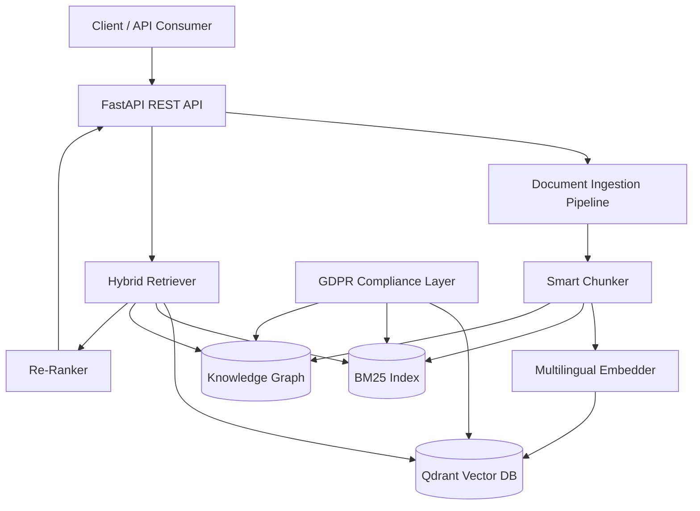

# Architecture

## System Overview

## Components

- **FastAPI REST API** — Entry point for all client interactions
- **Document Ingestion Pipeline** — Parses, chunks, and embeds uploaded documents
- **Smart Chunker** — Adaptive chunking strategies (legal, technical, general)
- **Multilingual Embedder** — sentence-transformers with multilingual model
- **Qdrant Vector DB** — Vector similarity search with tenant isolation
- **BM25 Index** — Keyword-based retrieval per language
- **Knowledge Graph** — NetworkX-based entity/relation graph
- **Hybrid Retriever** — Combines results from all three retrieval methods
- **Re-Ranker** — Weighted score normalization and re-ranking
- **GDPR Compliance Layer** — Tenant isolation, right to erasure, audit logging
